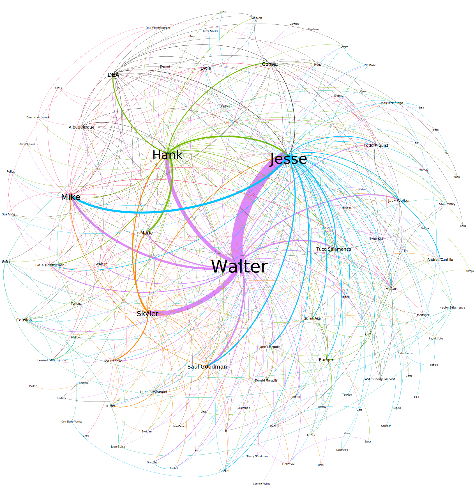

<h1 align = 'center'>Breaking Bad : Network Analysis</h1>

## Breaking Bad (An bird-eye view)


Breaking Bad is an American crime drama television series created and produced by Vince Gilligan.

**Plot**

Set and filmed in Albuquerque, New Mexico, the series follows Walter White, an underpaid, overqualified, and dispirited high-school chemistry teacher who is struggling with a recent diagnosis of stage-three lung cancer. Walt turns to a life of crime and partners with a former student, Jesse Pinkman, to produce and distribute crystal meth to secure his family's financial future before he dies, while navigating the dangers of the criminal underworld.

**Some interesting things**

- In the series viewers watch Walt go from protagonist to antagonist.
- Breaking Bad aired on AMC from 2008 to 2013 with five successful seasons and 62 total episodes.
- In 2013, Breaking Bad entered the Guinness World Records as the most critically acclaimed TV show of all-time.


- The cold opens became one of the most legendary parts of the show and were works of art in their own right.
- The number one ranked cold open is season 2 episode 7 when there is a music video titled “The Ballad of Heisenberg” about his ascension to the top of a drug empire.
- There’s an incredible cast, award-winning script, several spinoffs, multiple languages, and of course, that creative plot.
- Breaking Bad is one of the most successful series of all time, with a legacy that continues to inform new generations of shows.
- From the influential cold opens, incredible writing, sympathetic acting, and compelling plot, the series changed television forever.
- Just take a chance on the pilot and we know you’ll be hooked!

# The Project

It was inspired from [DataCamp](https://datacamp.com/)'s [A Network Analysis of Game of Thrones](https://datacamp.com/projects/76). While checking for already existing curated data, I failed to find the data which I needed. Thus decided to split the project into 2 parts.
1. **Data Gathering / Web Scrapping**
2. **Relationship Network analysis**


# [Part 1 : Data Gathering / Web Scrapping](https://github.com/jishnukoliyadan/the_breaking_bad_network/blob/master/Scrapper.ipynb)

- The first step to the project was to scrape data from [breakingbad.fandom.com](https://breakingbad.fandom.com/wiki/Breaking_Bad_(TV_series)) page.
- A total of 62 total episodes were relased for Breaking Bad series.

## What all the data interested to gather ?

- Summary of all 62 episodes and record it based on season.
    - ie, for 6 seasons, intersted in having only 6 summary files.
- Character list of each episodes.

## Tools used for this part

- Browser automation : [Selenium with Python](https://selenium-python.readthedocs.io/)
- Web page parser : [Beautiful Soup](https://www.crummy.com/software/BeautifulSoup/bs4/doc/)
- Data cleaning : [pandas](https://pandas.pydata.org/)


# [Part 2 : Relationship Network analysis](https://github.com/jishnukoliyadan/the_breaking_bad_network/blob/master/Relationship_Finder.ipynb)

- In Part-1 using [Scraper.ipynb](https://github.com/jishnukoliyadan/the_breaking_bad_network/blob/master/Scrapper.ipynb) we have generated the summaeirs all 62 episodes and character list.
- In this part using [Relationship_Finder.ipynb](https://github.com/jishnukoliyadan/the_breaking_bad_network/blob/master/Relationship_Finder.ipynb) we will analyse the relationship between characters.



## How we gonna proceed this part ?

- From the scraped data using named entity recognition and our own defined rules 'll create a relationship dataset.
- Over that relationship data we will perform centrality measures to find the most important character.
- Using community detection, we will try to find-out what all communities are present and leader of those clans.
- We will tkae the help of visualization techniques to make the analysis more simple.
- For further analysis, we will export the network data for the visualization in [Gephi](https://gephi.org/).

## Tools used for this part

- Natural Language Processing : [spaCy](https://spacy.io/)
- Network Analysis : [NetworkX](https://networkx.org/)
- Newtwork Visualization : [pyvis](https://pyvis.readthedocs.io/en/latest/index.html)
- Data cleaning : [pandas](https://pandas.pydata.org/)

# Project Directory structure

``` bash
├── LICENSE
├── README.md
├── breaking_bad.yml
├── requirements.txt
|
├── Scrapper.ipynb
├── Relationship_Finder.ipynb
|
├── data
│   ├── character_df_cleaned.csv
│   ├── character_df.csv
│   ├── season_nd_episode_links.txt
│   ├── gephi_files
│   │   ├──  # directory for storing CSV files Gephi visualisation tool
│   └── summaries
│       ├── # all 6 seasons summary files stored here
├── lib
│   └── # pyvis created directory
└── src
    ├── char_imp
    │   ├── # directory to store character importance plots
    ├── htmls
    │   ├── # directory to store pyvis plots 
    ├── imgs
    │   ├── # all images used in IPYNB notebooks and README files
    ├── plots
    │   ├── # directory to store centrality plots 
    └── plt_style
```

# Reproducing the project

To recreate this project on your own computer, do the following.<br>
I have used [JupyterLab](https://jupyterlab.readthedocs.io/en/stable/) through-out the project and assuming you'll too (If not, feel free to change the below code accordingly).

## 1. Using *yml* file

- Download the whole [the_breaking_bad_network](https://github.com/jishnukoliyadan/the_breaking_bad_network) directory to your local work space.

```
wget https://github.com/jishnukoliyadan/the_breaking_bad_network/archive/refs/heads/master.zip
unzip the_breaking_bad_network.zip
cd the_breaking_bad_network
```

- Once we are in **the_breaking_bad_network** directory, lets create conda environment and launch JupyterLab

```
conda env create -f breaking_bad.yml
conda activate breaking_bad
jupyter-lab
```

## 2. Using *requirements.txt* file

- Download the whole [the_breaking_bad_network](https://github.com/jishnukoliyadan/the_breaking_bad_network) directory to your local work space.

```
wget https://github.com/jishnukoliyadan/the_breaking_bad_network/archive/refs/heads/master.zip
unzip the_breaking_bad_network.zip
cd the_breaking_bad_network
```

- Let's create conda environment and activate it.

```
conda create -n breaking_bad python=3.10.8 -y
conda activate breaking_bad
```

- Install prerequisite libraries & lauch JupyterLab.

```
pip install -r requirements.txt --upgrade
jupyter-lab
```

# Reference & Credits

- Official documentations of all libraries
- [IMDb](https://www.imdb.com/title/tt0903747/), [Rotten Tomatoes](https://www.rottentomatoes.com/tv/breaking_bad), [Wikipedia](https://www.wikipedia.org/)
- [GeeksforGeeks](https://www.geeksforgeeks.org/), [Stack Overflow](https://stackoverflow.com/)
- [Cambridge Intelligence](https://cambridge-intelligence.com/keylines-faqs-social-network-analysis/), [Engineering for Data Science](https://engineeringfordatascience.com/posts/matplotlib_subplots/)
- [Kaggle : data-collection-web-scrapping-tutorial](https://www.kaggle.com/code/jishnukoliyadan/data-collection-web-scrapping-tutorial)
- Chapter 3 - Network Structure and Measures : [Analyzing the Social Web by Jennifer Golbeck](https://www.sciencedirect.com/book/9780124055315/analyzing-the-social-web)
- [Translating Networks: Assessing Correspondence Between Network Visualisation and Analytics](https://hal.archives-ouvertes.fr/halshs-02179024/)
- [pijamasurf.com](pijamasurf.com), [usmagazine.com](usmagazine.com)

# License

The license can be found in the [LICENSE](LICENSE) file.