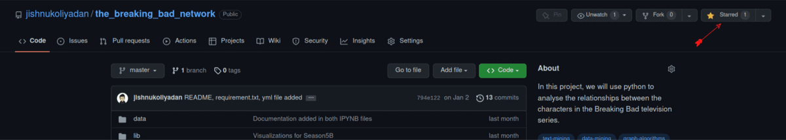
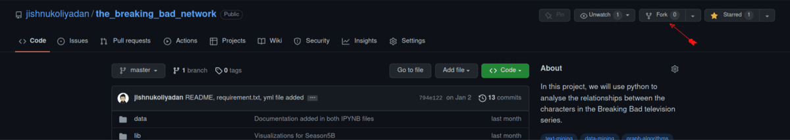
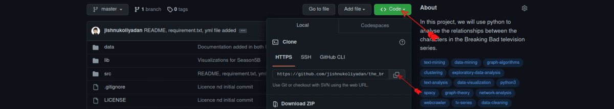

# How to Begin with Contributions

#### 0. Star this repository



#### 1. Fork this repository



#### 2. Clone this repo to your local environment



```bash
git clone https://github.com/jishnukoliyadan/the_breaking_bad_network.git
cd the_breaking_bad_network
```

#### 3. Set your streams (For sync your clone with the original repo)

```bash
git remote add upstream https://github.com/jishnukoliyadan/the_breaking_bad_network.git
git pull upstream master
```

#### 4. Create a branch

```bash
git checkout -b your-branch-name
```

#### 5. Make your addition / changes to the resective files

#### 6. Pull from the upstream again (This is to ensure we still have the latest code)

```bash
git pull upstream master
```

#### 7. Commit and Push your changes

```bash
git add .
git commit -m "commit message"
git push origin your-branch-name
```

- Create a new Pull Request from your forked repository, click the `New Pull Request` button located at the top of your repository
- Wait for you PR to be reviewed and merge approval!