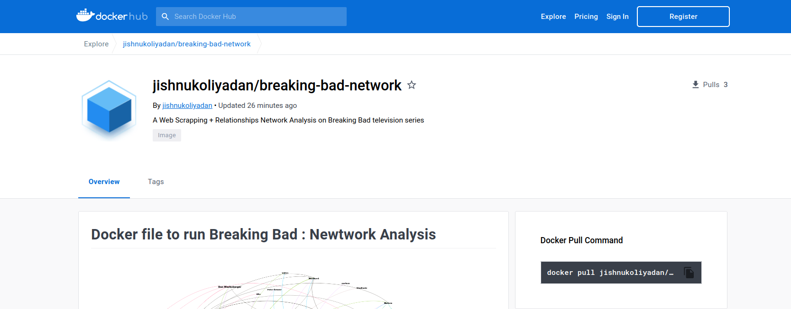

# Executing the project using Docker

Docker is a great tool for reproducibility. I have created a docker image for the project and hosted it on Docker Hub.

## What all the files are necessary ? 

The docker image contains all the files required for us. No need to bother or modify anything to proceed. All the below listed files are present inside the docker image.

```
├── LICENSE
├── README.md
├── breaking_bad.yml
│
├── Scrapper.ipynb
├── Relationship_Finder.ipynb
│
├── data
│   ├── character_df_cleaned.csv
│   ├── character_df.csv
│   ├── season_nd_episode_links.txt
│   └── summaries
│       └── # all 6 seasons summary files stored here
│
├── src
│   ├── imgs
│   │   └── # all images used in IPYNB notebooks and README files
│   └── plt_style
│
└── data_copy # Copy of 'data' directory
```

## How to pull the image and run locally ?

If you have [docker](https://docker.com/) installed then good to go. If not then please follow the [official documentation](https://docs.docker.com/get-docker/) to install it.

1. #### Pull the image from [docker hub](https://hub.docker.com/r/jishnukoliyadan/breaking-bad-network)

<p><a href = 'https://hub.docker.com/r/jishnukoliyadan/breaking-bad-network'>

</a></p>

```
docker pull jishnukoliyadan/breaking-bad-network
```

2. #### Run the pulled docker image

```
docker run -it --rm -p 8888:8888 jishnukoliyadan/breaking-bad-network /bin/bash -c "source activate breaking_bad && jupyter-lab --ip='*' --port=8888 --no-browser --allow-root"
```

**Note:**

* By default, the notebook server starts on port `8888`, we are exposing same port from container also.
* The usage of `--rm` flag, Docker automatically cleans up the container when the container exits.

3. #### Copy the URL and paste it on browser

Now you're good to go :thumbsup:

**Note :**

All the dependencies will be taken cared by the container itself. So no need to worry about those. To see the dependency libraries used here, follow this [link](https://github.com/jishnukoliyadan/the_breaking_bad_network/blob/master/breaking_bad.yml)

## What to do if we messed-up the data from Jupyter-Lab ?

* `data` and `src` directories *tree* structure is the only thing important for us.

#### Option 1 : Without closing Jupyter-Lab

* If we damaged files inside the `data` directory, then we can go with any of the below option.
    1. If we have time, scrape the data data using the [Scraper.ipynb](https://github.com/jishnukoliyadan/the_breaking_bad_network/blob/master/Scrapper.ipynb) file.
    2. Don't want to spend time for scrapping data, utilize the `data_copy` directory provided.

#### Option 2 : Restart the container

In-order to restart the container close the Jupyter-lab if its running and follow,

```
docker run -it --rm -p 8888:8888 jishnukoliyadan/breaking-bad-network /bin/bash -c "source activate breaking_bad && jupyter-lab --ip='*' --port=8888 --no-browser --allow-root"
```

## Once exploration is done !!

Once you're done with trying out, inorder to remove the docker image and save some space in your local system run,

```
docker rmi -f jishnukoliyadan/breaking-bad-network
```

Since the image is always available in [docker hub](https://hub.docker.com/r/jishnukoliyadan/breaking-bad-network), its a good practice to save the local system memory.